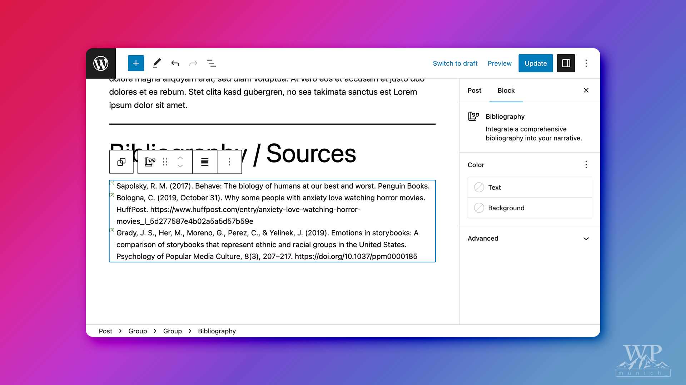
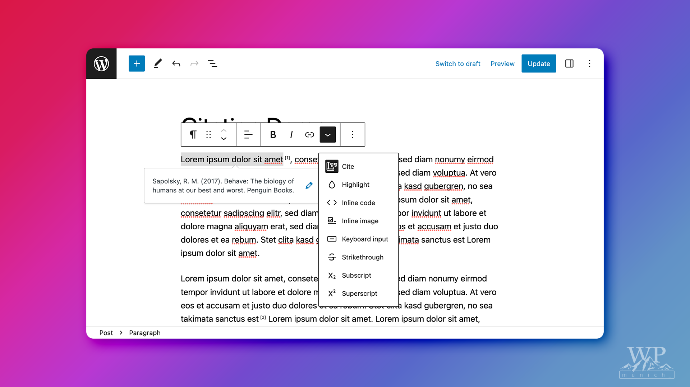

# Citations for WordPress

This WordPress plugin introduces practical citation functionality to the WordPress Block Editor, aiming to streamline the process of adding references to your content.

This WordPress project is made with love and brought to you by the folks of [WP Munich](http://www.wp-munich.com) and [Luehrsen // Heinrich](http://www.luehrsen-heinrich.de).

## Features

1.  **Cite Rich Text Format**: This feature lets users mark citations in their text and assign them a specific source. This makes adding citations straightforward, enhancing the clarity and reliability of your content.
2.  **Bibliography Block**: This plugin also offers a bibliography block that displays all referenced sources. The plugin creates links between your in-text citations and their corresponding sources in the bibliography block, making it easier for readers to find and check your references.

## How to use this WordPress Plugin

### Installation

#### From within WordPress (when the Plugin is reviewed and released)

1. Visit \'Plugins > Add New\'
1. Search for \'Citations\'
1. Activate \'Citations\' from your Plugins page.

#### Manually

1. Download the `citations.zip` from our [most recent release](./../../releases/latest).
1. Visit \'Plugins > Add New\'
2. Click the 'Add new' button.
3. Upload the `citations.zip` archive to your WordPress
4. Activate the \'Citations\' plugin through the \'Plugins\' menu in WordPress

### Creating In-Text Citations
1. Navigate to the Posts section of your WordPress dashboard.
1. Click on the Add New button to create a new post, or select an existing post where you want to add citations.
1. Type your content into the WordPress Block Editor.
1. To add a citation, first highlight the text that you want to cite.
1. With the text still highlighted, find and click on the "Cite" format from the rich text format toolbar.
1. A pop-up will appear asking you to define your source. Input the source information into the fields provided.

### Adding a Bibliography Block
1. Click on the + icon in the editor toolbar to add a new block to your post.
1. Search for "Bibliography" in the block search bar.
1. Click on the Bibliography block to add it to your post.
1. The Bibliography block will automatically populate with the sources of all the in-text citations you've added to your post. Each citation in the text is linked to its corresponding source in the bibliography, allowing readers to easily check your references.

### Editing Citations and Sources
1. To edit a citation or source, click on the citation in the text.
1. Make the necessary changes in the pop-up that appears.
1. Click on Save or Update to apply your changes.

### Using the Demo-Pattern

1. Click on the + icon in the editor toolbar to add a new pattern to your post.
2. Search for "Citations Demo" in the pattern search bar.
3. Click on the "Citations Demo" pattern to add it to your post.
4. A few lines of filler text with pre-defined citations and a bibliography block will appear in your post content.

### Screenshots

| The Bibliography Block | The Citations Rich Text Format |
|---|---|
|  |  |

## Contributing

Every bit of help is highly appreciated. Even if you don't code you can file an issue and help us find bugs or shape new features. Please see the [CONTRIBUTING.md](./CONTRIBUTING.md) on how to contribute.

## License

This plugin is licensed under [GNU General Public License v2 (or later)](./LICENSE.md).

## Changelog

Please find the current [changelog here](./../../releases).
